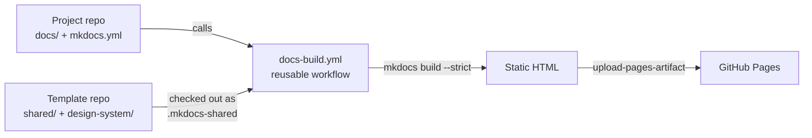
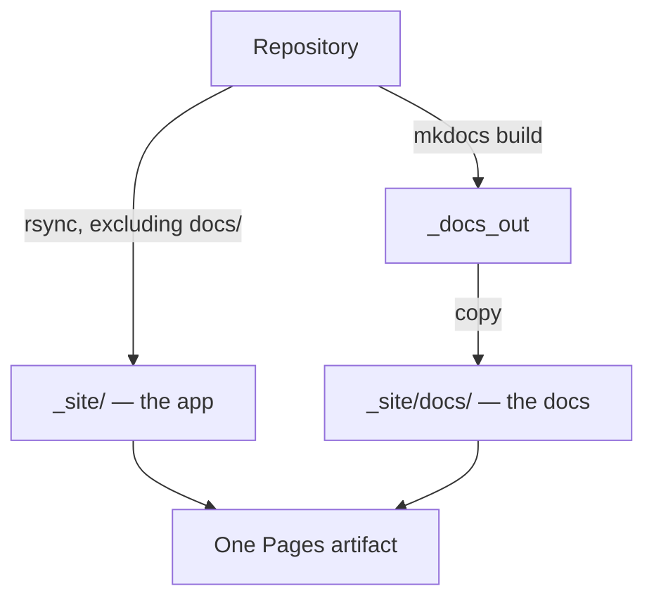

# Architecture

One repository holds the build logic, the theme, and the writing standard.
Every project repository holds content and a name. Nothing else is duplicated.

## Overview

A project repo's workflow calls the reusable workflow here, which checks this
repository out alongside it, stages the design system, and builds.



## Components

### Shared configuration

`shared/mkdocs.base.yml` holds the theme, palette, markdown extensions,
plugins, and validation rules. A project's `mkdocs.yml` starts with
`INHERIT: .mkdocs-shared/shared/mkdocs.base.yml` and declares only its own
identity.

MkDocs deep-merges dictionaries but **replaces** lists. That is why a project
repo must never declare `plugins:` or `markdown_extensions:` — doing so
silently discards the entire shared set rather than adding to it.

`shared/requirements-docs.txt` pins the toolchain. `shared/macros.py` supplies
Jinja variables and helpers so organisation-wide values live in one place.

### Design system

`design-system/` holds the CSS tokens, components, theme overrides, and icons.
It is staged into the project repo at build time rather than committed there,
so a restyle reaches every site on its next build.

Staging uses two different rules:

- **Stylesheets and scripts** are always overwritten. They are owned by the
  design system.
- **Theme overrides and icons** are copied with `cp -rn` (no-clobber), so a
  repo that commits its own `overrides/main.html` keeps it.

### Workflows

`docs-build.yml` builds and deploys. `docs-lint.yml` runs the pull-request
checks and never deploys. Both are `workflow_call` targets; the copies in
`template/.github/workflows/` are the thin callers.

A reusable workflow cannot grant its own permissions, which is why every
caller carries `pages: write` and `id-token: write`.

## Data flow

A push to a project repo's default branch triggers its `docs.yml`, which calls
`docs-build.yml` here. That workflow:

1. Checks out the project repo at full depth — `git-revision-date-localized`
   reads history to date each page, and a shallow clone breaks it.
2. Checks this repository out into `.mkdocs-shared/`.
3. Installs the pinned dependencies, cached on the requirements file.
4. Stages the design system into `docs/` and `overrides/`.
5. Runs `mkdocs build --strict`.
6. Assembles the artifact and deploys it.

### Coexisting with an existing site

About a dozen repos already serve an application at their Pages root. Setting
`docs_subpath: docs` changes step 6: the existing site is copied to the
artifact root and the built docs are nested underneath.



The repo's original Pages workflow must be deleted when this is enabled. Two
workflows deploying to Pages contend for the same deployment and one fails
intermittently.

## Directory layout

```text
.
├── shared/               Config inherited by every repo
│   ├── mkdocs.base.yml   Theme, extensions, plugins, validation
│   ├── requirements-docs.txt
│   ├── macros.py         Jinja variables and helpers
│   └── lint/             markdownlint and lychee configuration
├── design-system/        Staged into every repo at build time
│   ├── stylesheets/      Tokens and components
│   ├── javascript/       Table sorting
│   ├── icons/            Custom SVGs
│   └── overrides/        Material theme partials
├── template/             Copied into a project repo verbatim
├── scripts/              Local preview
├── docs.instructions.md  Writing standard
└── ROLLOUT.md            Per-repository procedure
```

## Design decisions

**Config inheritance over copied config.** A self-contained `mkdocs.yml` per
repo would avoid the `.mkdocs-shared` checkout, but a Material upgrade would
then mean 130 pull requests. The cost is that local preview needs the shared
checkout, which the preview scripts handle.

**Assets staged at build time over committed assets.** Committing the CSS into
each repo would make local preview trivial, but stale copies would silently
diverge. Staging keeps one source of truth; the gitignore entries stop a copy
from being committed by accident.

**Root files included, not copied.** `pymdownx.snippets` with `base_path: '.'`
lets a docs page pull in the repository's `CHANGELOG.md`. `check_paths: true`
makes a missing file a hard error, which is deliberate: a silent empty page is
worse than a failed build.

{{ support() }}
