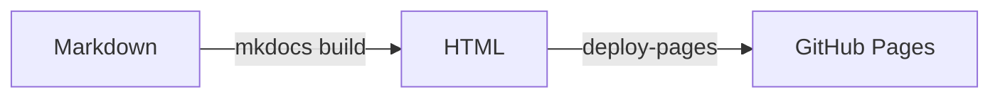

# Design system

Every shared component, rendered. Check a change here before it reaches every
site — this page is the reason the design system has a visual reference at all.

Toggle the theme with the icon in the header. Anything that fails in one mode
and works in the other is a bug: no component may hardcode a colour.

## Tokens

Colour is defined once on `:root` for light and re-declared under
`[data-md-color-scheme="slate"]` for dark. Components reference the semantic
token, never the ramp value.

| Token | Role |
|---|---|
| `--wt-primary` | Brand colour for links, accents, and active states |
| `--wt-primary-soft` | Tinted background for emphasis blocks |
| `--wt-surface` | Page background |
| `--wt-surface-raised` | Cards, table headers |
| `--wt-border` | Hairlines and dividers |
| `--wt-text` | Body text |
| `--wt-text-muted` | Secondary text, labels |

Spacing runs `--wt-space-1` through `--wt-space-7` (0.25rem to 3rem). Radii are
`--wt-radius-sm`, `-md`, `-lg`, and `-full`.

## Card grid

Used on every `index.md` to route readers into the main sections.

<div class="wt-grid" markdown>

[:material-rocket-launch: **Getting started**<br>From zero to a working result](getting-started.md){ .wt-card }

[:material-sitemap: **Architecture**<br>How it is put together](architecture.md){ .wt-card }

[:material-tune: **Configuration**<br>Options and flags](configuration.md){ .wt-card }

</div>

````markdown
<div class="wt-grid" markdown>

[:material-rocket-launch: **Getting started**<br>From zero](getting-started.md){ .wt-card }

</div>
````

## Hero

Optional lead block at the top of a landing page.

<div class="wt-hero" markdown>

## Documentation that stays consistent

One configuration, one design system, one writing standard — across every
repository.

</div>

## Badges

Inline status markers for API and configuration tables.

`Stable`{ .wt-badge .wt-badge--success }
`Beta`{ .wt-badge .wt-badge--info }
`Deprecated`{ .wt-badge .wt-badge--warning }
`Removed`{ .wt-badge .wt-badge--danger }
`Default`{ .wt-badge .wt-badge--primary }
`Internal`{ .wt-badge }

```markdown
`Deprecated`{ .wt-badge .wt-badge--warning }
```

## Facts list

For short key/value blocks.

<dl class="wt-facts" markdown>
<dt>Licence</dt><dd>MIT</dd>
<dt>Python</dt><dd>3.9 and later</dd>
<dt>Status</dt><dd>Stable</dd>
</dl>

## Steps

Numbered procedure with a visible spine, for `getting-started.md`.

<ol class="wt-steps" markdown>
<li markdown>

Clone the repository.

```bash
git clone https://github.com/willtheorangeguy/mkdocs
```

</li>
<li markdown>

Stage the design system and serve.

```bash
scripts/docs-serve.sh
```

</li>
</ol>

## Reference table

Wrapping a table in `wt-reference` gives it denser type, a sticky header, a
monospaced first column, and click-to-sort headers.

<div class="wt-reference" markdown>

| Option | Type | Default | Description |
|---|---|---|---|
| `log_level` | string | `info` | One of `debug`, `info`, `warning`, `error` |
| `timeout` | integer | `30` | Seconds before a request is abandoned |
| `retries` | integer | `3` | Attempts before giving up |
| `output` | path | `./out` | Directory for generated files |

</div>

## Admonitions

!!! note
    An aside the reader can skip.

!!! tip
    An optional improvement.

!!! warning
    Something that will cause a problem.

!!! danger
    Data loss, security, or anything irreversible.

???+ question "A collapsible FAQ entry"
    Open by default. Use `???` instead of `???+` to start collapsed.

## Code

```python title="example.py"
def build(config: dict) -> int:
    """Build the site and return the number of pages written."""
    return len(config["nav"])
```

Tabbed blocks, for per-platform instructions:

=== "Windows"

    ```powershell
    py -m pip install example
    ```

=== "macOS / Linux"

    ```bash
    python3 -m pip install example
    ```

## Diagrams

Mermaid renders natively, in both themes. Never hardcode node colours.



## Icons

Material's full icon set is available, plus custom SVGs from
`design-system/icons/`. A file at `icons/wt/docs.svg` becomes `:wt-docs:`.

:material-rocket-launch: :material-tune: :material-sitemap: :wt-docs:

```markdown
:material-rocket-launch: :wt-docs:
```

Custom icons must use `currentColor` for their fill so they inherit the
surrounding text colour and stay legible in both themes.

{{ support() }}
