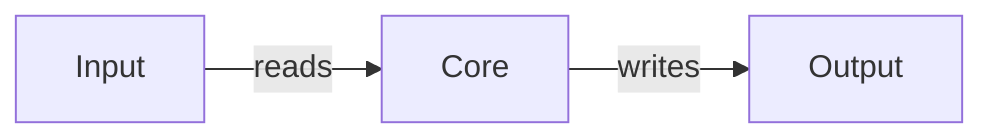

<!--
  ARCHITECTURE

  Written for someone about to modify the code, not for someone evaluating
  the project.

  The diagram is required and must be Mermaid — never an image. Keep it
  under ~12 nodes, label every edge, and never hardcode colours: the theme
  supplies them and hardcoded fills go unreadable in dark mode.
-->

# Architecture

<!-- One paragraph: the shape of the system in plain terms. -->

## Overview

<!-- A lead-in sentence, then the diagram. A diagram with no introduction
     makes the reader reverse-engineer its purpose. -->



## Components

<!-- One H3 per major component. Responsibility and boundaries — what it
     owns and what it explicitly does not. Not a file listing. -->

### <!-- TODO: component -->

<!-- What it is responsible for. What it deliberately does not do. -->

## Data flow

<!--
  How one request, run, or invocation moves through the system, start to
  finish. A sequence diagram works well here when there are more than two
  participants.
-->

## Directory layout

<!--
  ONLY the paths that matter to someone making a change. Not every file.
  Annotate each entry with what lives there.
-->

```text
.
├── src/            TODO
├── tests/          TODO
└── docs/           Documentation source for this site
```

## Design decisions

<!--
  Optional but valuable. For each: what was chosen, what it was chosen over,
  and why. This is the context that is otherwise only in someone's head.

  Do not editorialize about code quality — record decisions, not opinions.
-->

{{ support() }}
